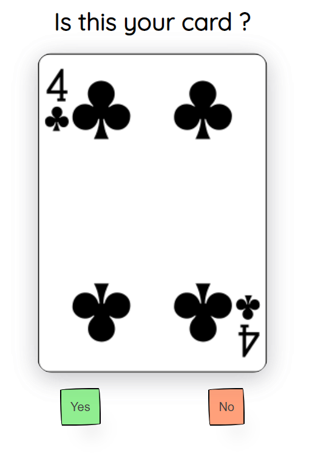
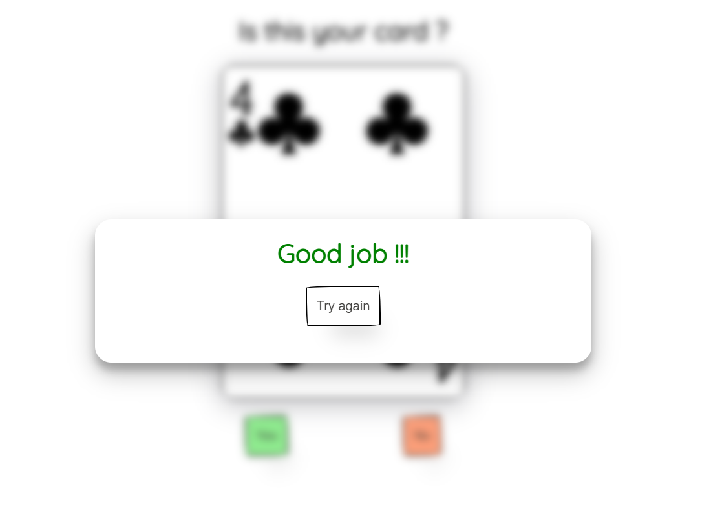

# How to create guess the card game 

## Step 1
### Read the documentation of an API

In the documentation we have read that we can call the api using various different links and paths

Since we want to get 3 random car we will use the following link

`https://deckofcardsapi.com/api/deck/new/draw/?count=3`

The api will return 3 random cards with their **name, code, value, suit and image**

We are only interested in the image which will be retrieved as a link

`https://deckofcardsapi.com/static/img/6H.png`

and since the api returns array of objects we will be accessing the card as follows

````javascript
response[cardNumberInArray].image
````

## Step 2
### Create basic HTML


````html
<div class="card">
    
</div>

<div class="actions">
    <button class="yesButton yesBackground" onclick="yesClick()">
        Yes
    </button>
    
    <button class="noButton noBackground" onclick="noClick()">
        No
    </button>
</div>
````

**Card division**
Here the image of tha card will be displayed 

**Buttons**
The game should have some interactions so we are going to need two buttons to get the user input
*Yes* if the user guessed the card right
*No* if the user guessed he card wrong

## Step 3
### Call the api

#### Environment set-up

To call the api we are going to need JavaScript file to handle the call

We will create new directory called ``js`` and add file called ``index.js``

(you can name the files however you want)

Than you have to include your JS file in the HTML so that we can actualy dispaly something 

````html 
<script src="js/index.js"></script>
````

#### Calling the api

In the newly created JavaScript file we first have to create a function tha will call the api and fetch all of the data fron the response 

We have to do it in smart way so that user doesn't have to wait until the data are retrieved

It just so happens that JavaScript has a way how to do it 

``async`` ``await`` syntax

``async`` is key word that is put before the function declaration and makes the function return the promise 
inside this function the ``await`` keyword is allowed to be used it makes the function pause the execution and wait for resolved promise before continuing 

Using this knowladge we can construct the following function

```javascript
async function getData(url) {
    try {
        console.log('getting data');
        
        //waiting until fetch function returns response
        let response = await fetch(url);
        
        //waiting until response is converted to JSON format
        let data = await response.json();
        
        console.log('data retrieved');
        return data;
    }
    catch (err) {
        //error handling
        console.error("Error: ", err);
    }
}
```

this function returns data of the api which url is passed as the parameter

#### Storing data 
Now when we have the data we can store them in some variable we can name it ``cards`` however we can not forget that api is returning arraz of the objects hence we need to make this varaible and array like so

```let cards = []```

Now to load retrieved data to this variable we will create new ``async`` function where we can use ``await`` keyword to get the fetched data and store them to our array

```javascript
async function loadData() {
    //waing until we get the data 
    let data = await getData('https://deckofcardsapi.com/api/deck/new/draw/?count=3');
    cards = data.cards;
    
    //image element retrieved form the HTML document
    cardImage.src = cards[currentIndex].image;
}
```

In order to actually store the response we need to simply call this function

```loadData();```

## Step 4
#### User input

In our HTML we have created 2 buttons that will handle user input since the goal of this game is really easy (see if the displayed card is a card you were thinking about) we have implement this logic into our JavaScript file

##### Button event listeners

To get the user's response by clicking one of the buttons we have to assign event listeners to them

Event listener is function that will be run as soon as user presses the button

Since we have 2 buttons we have to create 2 event listeners

- Yes button was clicked
- No button was clicked

```javascript
function yesClick(){
    displayPopUp();
    popUpHeader.innerHTML = "Good job !!!"
    popUpHeader.style.color = "green";
}

function noClick() {
    if(currentIndex < 2) {
        currentIndex++;
        cardImage.style.rotate = `y ${rotations}deg`
        cardImage.src = cards[currentIndex].image;
        rotations += 360;
    }
    else {
        popUpHeader.innerHTML = "You lost :("
        popUpHeader.style.color = "black";
        displayPopUp();
    }
}
```

**If yes button was pressed**
- open popup that will reward the player with some worm words

**If no button was pressed**
- check if the user have still some attempts
- play the animation of card rotating and increase the index of displayed card so the next image is shown

  - if user has no attempts left we will display the popup that the user has lost


## Step 5
### Restarting the game

To restart the game we will create popup with **Try again** inside HTML and using the CSS we will make it dissapear

We have our opening and clossing popup logic abastracted in the functions the only thing to do is to add *event listener* to the **Try again button**
so lets do that

```javascript
    function resetGame() {
    hidePopUp();
    currentIndex = 0;
    loadData();
}
```
this function will make the new call to the api to retriev new set of cards as well as resets the index of the image that is currently displayed 


## Step 6
### Sick design

Using css we can give our little game life with some animations and cozy colors with the right styling we are able to achieve something like this in no time




